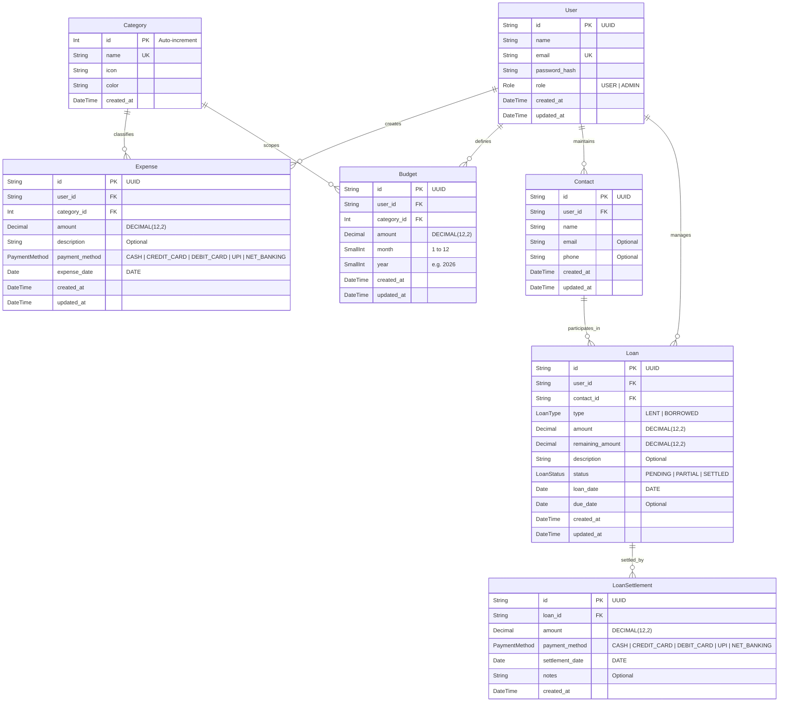

# 06 — Database Schema & Data Models

This document details the database architecture of ExpenseWise, including PostgreSQL data types, Prisma ORM configurations, entity relationships, indexes, unique constraints, and delete cascade behaviors.

---

## 1. Database Entity-Relationship (ER) Diagram



---

## 2. Enums

### `Role`
- `USER`: Default role for all standard registrants.
- `ADMIN`: Platform administrator with full access to `/admin`, platform metrics, user inspection, and global category creation.

### `PaymentMethod`
- `CASH`: Cash payments.
- `CREDIT_CARD`: Credit card transactions.
- `DEBIT_CARD`: Debit card / ATM withdrawals.
- `UPI`: Indian Unified Payments Interface (GPay, PhonePe, Paytm, CRED).
- `NET_BANKING`: Direct bank transfer (IMPS, NEFT, RTGS).

### `LoanType`
- `LENT`: Money lent to a peer (Receivable asset).
- `BORROWED`: Money borrowed from a peer (Payable liability).

### `LoanStatus`
- `PENDING`: Zero settlements recorded; initial amount equals remaining amount.
- `PARTIAL`: One or more partial settlements recorded; `0 < remainingAmount < amount`.
- `SETTLED`: Fully repaid; `remainingAmount = 0`.

---

## 3. Detailed Model Specifications

### 3.1 `User` (`users` table)
- **Primary Key**: `id` (`TEXT` / UUID default).
- **Unique Constraints**: `email` (Case-sensitive in schema, validated lowercase in actions).
- **Indexes**: `idx_user_email` on `[email]`.
- **Relations**:
  - `expenses`: `Expense[]` (Cascade delete on user removal).
  - `budgets`: `Budget[]` (Cascade delete on user removal).
  - `contacts`: `Contact[]` (Cascade delete on user removal).
  - `loans`: `Loan[]` (Cascade delete on user removal).

### 3.2 `Category` (`categories` table)
- **Primary Key**: `id` (`SERIAL` / Auto-increment integer).
- **Unique Constraints**: `name` (Unique category title).
- **Fields**: `icon` (Lucide icon identifier string), `color` (Hex color code e.g. `#EF4444`).
- **Relations**:
  - `expenses`: `Expense[]` with `onDelete: Restrict` (prevents deleting categories in use).
  - `budgets`: `Budget[]` with `onDelete: Cascade`.

### 3.3 `Expense` (`expenses` table)
- **Primary Key**: `id` (`TEXT` / UUID default).
- **Precision**: `amount` stored as `DECIMAL(12, 2)`. `expenseDate` stored as `DATE` (`@db.Date`).
- **Foreign Keys**:
  - `userId` ➔ `User.id` (`onDelete: Cascade`).
  - `categoryId` ➔ `Category.id` (`onDelete: Restrict`).
- **Indexes**:
  - `idx_user_expense_date` on `[userId, expenseDate]`: Optimizes dashboard trend queries and date range filters.
  - `idx_user_category_date` on `[userId, categoryId, expenseDate]`: Optimizes monthly category sum aggregations.

### 3.4 `Budget` (`budgets` table)
- **Primary Key**: `id` (`TEXT` / UUID default).
- **Precision**: `amount` stored as `DECIMAL(12, 2)`. `month` and `year` stored as `SMALLINT`.
- **Unique Constraints**: `uq_user_category_period` on `[userId, categoryId, month, year]` (enforces one budget limit per category per period).
- **Indexes**: `idx_user_period` on `[userId, year, month]`.
- **Foreign Keys**:
  - `userId` ➔ `User.id` (`onDelete: Cascade`).
  - `categoryId` ➔ `Category.id` (`onDelete: Cascade`).

### 3.5 `Contact` (`contacts` table)
- **Primary Key**: `id` (`TEXT` / UUID default).
- **Unique Constraints**: `uq_user_contact_name` on `[userId, name]` (ensures contact names are unique per user).
- **Indexes**: `idx_user_contact` on `[userId]`.
- **Relations**:
  - `loans`: `Loan[]` with `onDelete: Restrict` (prevents deleting contacts with active loans).

### 3.6 `Loan` (`loans` table)
- **Primary Key**: `id` (`TEXT` / UUID default).
- **Precision**: `amount` and `remainingAmount` stored as `DECIMAL(12, 2)`. `loanDate` and `dueDate` stored as `DATE`.
- **Foreign Keys**:
  - `userId` ➔ `User.id` (`onDelete: Cascade`).
  - `contactId` ➔ `Contact.id` (`onDelete: Restrict`).
- **Indexes**:
  - `idx_user_loan_status` on `[userId, status]`: Optimizes dashboard active debt aggregation (`status != 'SETTLED'`).
  - `idx_user_contact_loan` on `[userId, contactId]`.
- **Relations**:
  - `settlements`: `LoanSettlement[]` with `onDelete: Cascade`.

### 3.7 `LoanSettlement` (`loan_settlements` table)
- **Primary Key**: `id` (`TEXT` / UUID default).
- **Foreign Key**: `loanId` ➔ `Loan.id` (`onDelete: Cascade`).
- **Indexes**: `idx_settlement_loan` on `[loanId]`.

---

## 4. Migration History

All migrations are tracked under [`prisma/migrations/`](file:///d:/Sunbeam/Project/Expense-tracker/prisma/migrations/):
- **`20260914145225_init`**: Created initial PostgreSQL schema with all 7 models, 4 enums, unique constraints, foreign keys, and indexes.

### Running Migrations
```bash
# Apply pending migrations to PostgreSQL database
npx prisma migrate dev

# Generate fresh Prisma Client
npx prisma generate
```
